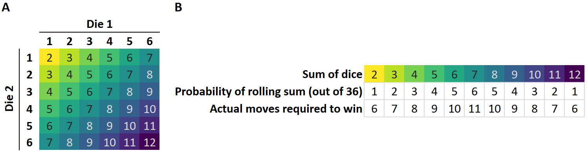
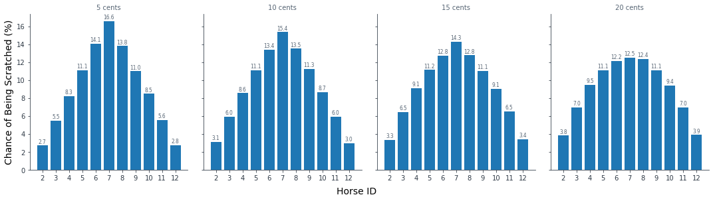
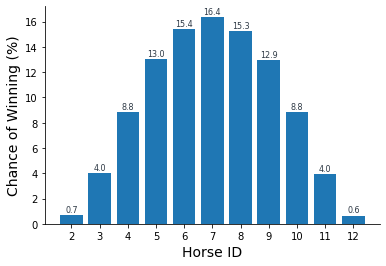
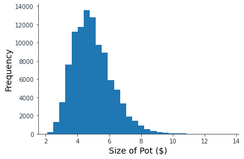

### Introduction

Horsey is a simple game of chance where players pay into the pot and move horses based on dice rolls.  My family’s Horsey board was handmade by my grandpa over 20 years ago (commercial versions with slightly different shapes also exist).  I fondly remember vacations at the lake with family and friends getting rowdy as they cheered for their horse to win.  

After years of being buried under piles of stuff in my parents' garage and presumed lost, the board finally resurfaced, and we whipped out the game at our small pandemic Christmas gathering.  While feeling nostalgic, everyone claimed to have witnessed horse #2 winning the race, despite it being one of the most poorly positioned horses on the board. 

This prompted me to find the actual probability of horse #2 winning, in part for my own interest, and in part to settle the family dispute. 

### Rules of Horsey

<b>Figure 1.</b> Horsey gameplay.  A) Align all horses to starting point.  
B) For scratches, move horses backwards for each monetary value. C) Play until a horse reaches the end of the board. 

1.  Gameplay begins with players coming armed with a Tupperware container filled with five dollars worth of dimes and nickels.
2.	Horses labeled #2 to #12 are lined up at the starting point on the board (Fig 1A)
3.	The player behind the dealer determines the scratches by rolling two dice and taking the sum.  They keep rolling until four unique numbers are chosen for the 5, 10, 15, and 20 cent scratches (Fig 1B).
4.	Aces and kings are removed from the deck and cards are dealt to each player as equally as possible1. 
5.	Each player pays into the pot for every card in their hand that matches the value of the scratches (jacks and queens are #11 and #12) and the remaining cards in their hand represent tickets that will pay out from the pot if the corresponding horse wins.
6.	The player ahead of the dealer starts the game rolling two dice.  If the value matches a scratched horse, they pay into the pot depending on the monetary value of the scratch.  If the value is not a scratch, that horse moves ahead one spot.
7.	Each player rolls until one of the horses reaches the end of the racetrack (Fig 1C). Each horse has a different number of steps it needs to advance to reach the end.
8.	Anyone with the winning horse’s card in their hand gets an equal piece of the pot. Thus, as there are up to four cards for each horse, the pot can be split up to four ways, with players holding multiple cards potentially taking more than one share.

### Dice Probabilities

For two regular six-sided dice, all possible summed values are show in Fig 2A.  The only way to get a 2 is by rolling “snake-eyes” (a 1 on both dice) but there are many ways to roll a 7.  This is summarized in Fig 2B where a roll of 2 has a 1/36 chance of being rolled, while a 7 has a 6/36 chance of being rolled (the 7 is six times more likely).  

<b>Figure 2.</b> A) All possible summed values of two dice.  B) How often each sum of dice is rolled
of out 36 possibilities, compared to the steps required for each horse to win the game.

Because the distribution of the steps each horse needs to take to win and the distribution of roll probabilities are not the same, some horses should be more likely to win than others. For example, horse #7 is 6x more likely to be rolled compared to horse #2, but only has to advance 11/6 = 1.8x the number of steps.  This makes horse #7 most likely to win, and horse #2 a long-shot.  

However, the scratches add complexity since the most common rolls (e.g. 5-9) will also be more likely to be scratched (and ineligible to win that round).  Depending on which horses are scratched the pot size will vary.  A round where horses #5, #6, #7 and #8 are scratched the pot will likely be large, while in a round where horses #2, #3, #11, and #12 are scratched the pot will likely be small.  

Now that we know the basics, let’s get into the simulations.

### Results

All Python code to simulate gameplay and graph results can be found on [GitHub](https://github.com/ursulahneumann/simulate-horsey-game).  

I simulated 100,000 rounds of gameplay, keeping track of the scratches, winner, and pot size for each round.  As the 5 cent scratch is rolled first, the probabilities of each horse being chosen resembles the probabilities outlined in Fig 2B (horse #7 = 6/36 = 17%, horse #2 = 1/36 = 3%) (Fig 3).  As we move onto the 10, 15, and 20 cent scratch consecutively, the probability of choosing a 7 decreases slightly (to 13%), and the probability of choosing a 2 increases slightly (to 4%) (Fig 3).  This is because each successive scratch must be different than the ones previously chosen, so if a 7 is chosen as the first scratch, it cannot be chosen for the other scratches.  

<b>Figure 3.</b> Probability of each horse being scratched per monetary value.

Despite the higher chances of a 7 being chosen as a scratch, #7 still remains the most likely horse to reach the end with a 16% chance of winning, while horse #2 has 0.7% chance of winning (Fig 4).

<b>Figure 4.</b> Probability of each horse winning the race.

There is a wide range of pot sizes that could possibly occur.  The minimum is $2.10 set largely by the fact that all the scratch cards in the players' hands get paid before the round begins (totalling $2).  The median pot size is $4.80, and with the histogram being slightly right-skewed, with the highest pot size being $13.55 (Fig 5).

<b>Figure 5.</b> Histogram of pot sizes.

### Final Thoughts
Horse #2 wins 0.7% of the time, or once every 143 rounds.  This year we played 12 rounds, which means if we played once a year it would take 12 years to play 143 rounds, potentially a long time to wait to witness this rare occurrence.  Will my family believe the numbers?  

### Footnotes
1 The way we actually play is to deal out an equal number of cards to all players which sometimes leaves a remainer of a couple of cards that are not dealt out.  For example with 44 cards and 7 players, 2 cards will not be dealt and if these cards are scratches they won't get paid into the pot at the beginning of the round affecting the total pot size.  Since this varies depending on the number of players, for simplicity I coded the simulation to deal out all the cards (which would result in some players ahead of the dealer having 1 card more than others).